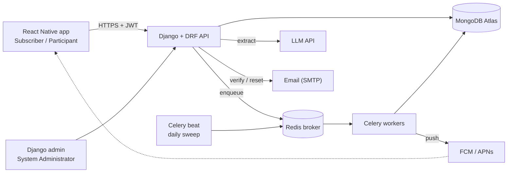
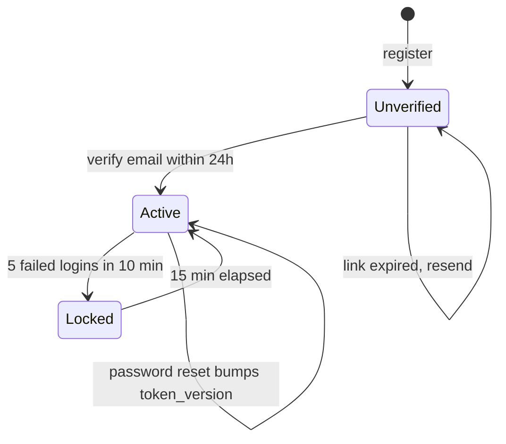
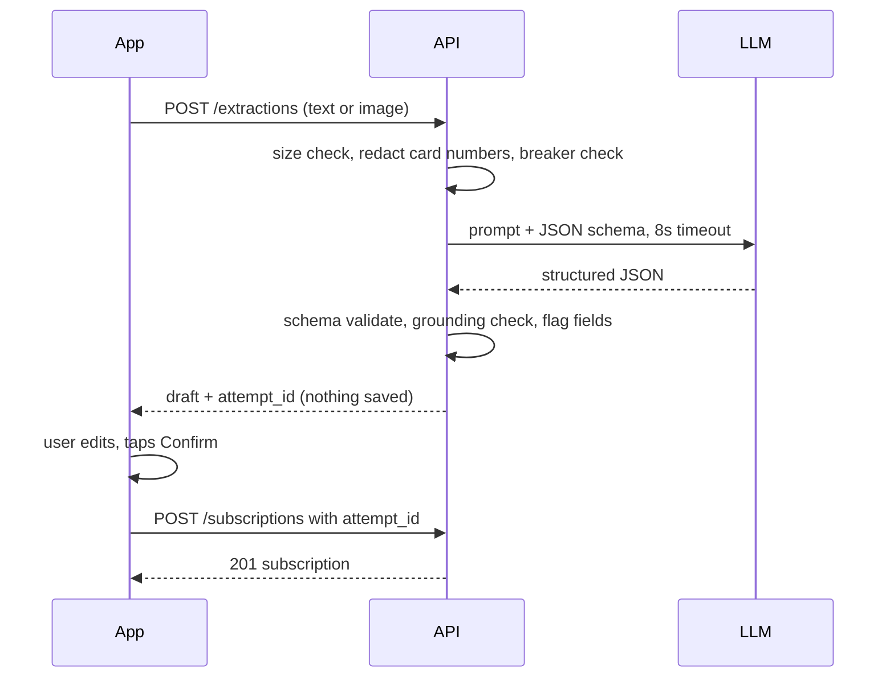
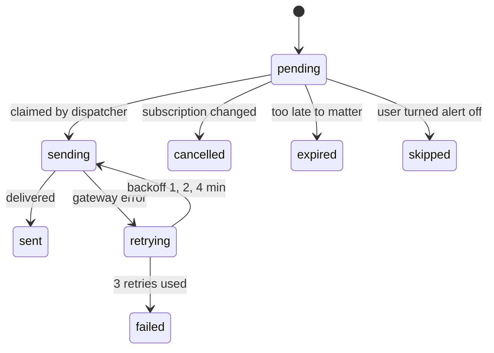
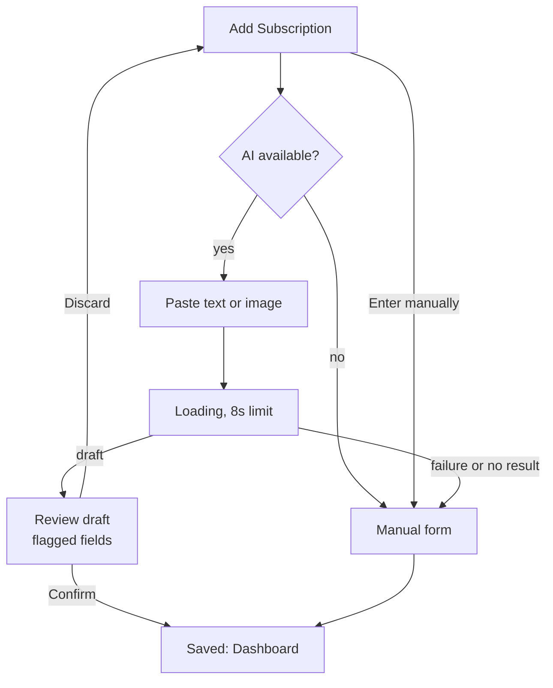

# SubTrak — System Design Specification

2026-09-21 · @Someone

## 1. Purpose, Scope, and Constraints

SubTrak is a privacy-first mobile app where users manually log recurring charges and an LLM turns pasted receipts into confirmed records. This specification defines the architecture, data model, interfaces, and failure behavior needed to build Epics A–H (US-1 to US-19) from the project charter within the five-sprint plan.

**Goals**

- Deliver every user story in the charter with its acceptance criteria testable as written.
- Keep the LLM inside the application: schema-validated output, explicit user approval, and a working manual path when it fails.
- Never ask for bank or card credentials; the app holds only what the user types or confirms.
- Get money, dates, and time zones right, because users will notice a wrong renewal date or total.
- Stay buildable by four students in 14 weeks on free or student-tier infrastructure.

**Non-goals**

- Bank or card linking, and transaction import of any kind.
- Moving money. The splitter records who owes what; it does not collect or settle payments.
- A web client, team or organization accounts, or multi-tenant billing.
- Account deletion and data export are undecided (charter gap, see section 15).

**Design constraints**

| Constraint | Source | Design consequence |
| --- | --- | --- |
| Python, Django, Django REST Framework | Capstone guidelines §3 | API-only backend; Django admin is the only server-rendered UI |
| MongoDB via django-mongodb-backend | Guidelines §3 | Embedded documents instead of joins; limited ForeignKey use |
| LLM feature must carry weight and have a graded fallback | Guidelines §2, §7 | Extraction is an isolated subsystem with a defined manual path |
| Data correctness matters | Guidelines §2 | Decimal money, timezone-aware datetimes, pure-function calculators with heavy tests |
| Unit and integration tests, stated coverage by Week 10 | Guidelines §7 | Business rules live in service modules that run without a database or network |
| No real personal or financial data from real people | Guidelines §2 | Seed data and test receipts are synthetic; no production user data during the course |
| React Native, JWT, Celery + Redis, Figma | Project idea and charter | Bearer-token API, FCM/APNs push, scheduled workers, wireframes before screens |

## 2. Architecture Overview

SubTrak is a modular monolith: one Django/DRF API split into apps by bounded area, a Celery worker tier for scheduled work, and three outside services (LLM, push gateway, email). One deployable API keeps a four-person team from paying a distributed-systems tax.



The phone talks only to the API; the API and workers share MongoDB; the push gateway is the only system that reaches the phone unprompted. The charter's context diagram omits email delivery, which US-1 and US-3 require, so it is added here as a third external system.

**Django apps and what each owns**

| App | Owns | Stories |
| --- | --- | --- |
| accounts | User, email verification, password reset, lockout, JWT, profile, currency and time zone, notification preferences | US-1 to US-5, plus profile and preference gaps |
| subscriptions | Subscription, categories, billing events, dashboard and category aggregation | US-6 to US-8, US-16 |
| extraction | Extraction requests, LLM client, schema validation, circuit breaker | US-9 to US-11 |
| sharing | Shared plans, participants, splits, invitations | US-14, US-15 |
| notifications | Reminder schedule, device tokens, delivery log, in-app inbox, Celery tasks | US-12, US-13, US-18, US-19 |
| analytics | Annual projection and category trends (read-only) | US-17, trends gap |
| core (existing) | Health check and shared utilities | none |

**Key architectural decisions**

- **Synchronous extraction, asynchronous reminders.** The LLM call runs inside the API request with a hard 8-second timeout, so US-9's 10-second target holds and the AI feature does not depend on Redis. Reminders are time-triggered, so they run in Celery.
- **Services hold the rules.** Views validate and serialize; a `services/` module per app holds calculations and workflows as plain Python that tests can call without a database or network.
- **Store the original, convert at display.** Prices are saved in the currency the user entered; conversion happens on read (US-4, US-19).
- **Derive schedules from data.** Reminders are rows generated from subscription dates, so a lost Redis queue can be rebuilt from MongoDB.
- **Wrap every external call.** Timeout, bounded retries, and a named fallback for each (section 12).

## 3. Technology Stack

The stack follows the capstone guidelines and project charter, with three choices made here: Expo for the mobile toolchain, pydantic for the LLM output contract, and a token-version claim instead of a token blacklist for JWT revocation.

| Layer | Choice | Rationale |
| --- | --- | --- |
| Backend | Python 3.12+, Django 6.1, Django REST Framework | Required by guidelines; the repo already runs Django 6.1.1 |
| Database | MongoDB Atlas 7.0+ via django-mongodb-backend 6.1.x | Required; the backend's minor version must match Django's, and [6.1.0 requires Django 6.1](https://www.mongodb.com/community/forums/t/django-mongodb-backend-6-1-0-is-now-available/342539) |
| Auth | djangorestframework-simplejwt for access and refresh tokens, with a per-user `token_version` claim | Session invalidation on password reset (US-3) without a blacklist table that assumes relational foreign keys |
| Scheduling | Celery 5 + Redis, Celery beat for the daily sweep | Named in the charter; free-tier or Docker Redis is enough |
| LLM | Provider behind an `ExtractionProvider` interface; default a small, fast vision-capable model (Claude Haiku 4.5) | Handles text and screenshots at low latency and cost; the interface lets tests inject a fake |
| LLM output contract | pydantic v2 models | Strict validation with readable errors for US-9 and US-10 |
| Mobile | React Native with Expo, TypeScript, React Navigation, TanStack Query | Expo removes native build setup and provides push registration |
| Push | Expo Push Service (relays to FCM and APNs) | One server-side call instead of two gateway integrations; Android-first for demos avoids an Apple developer fee |
| Money and time | `Decimal` fields, never floats; IANA zone names with `zoneinfo`; UTC in storage | Correctness requirements in US-4, US-5, US-17 |
| Exchange rates | Daily Celery job storing rates from a free ECB-based source such as Frankfurter | Satisfies US-4's "most recent stored exchange rate" |
| Testing | pytest + pytest-django, coverage.py; Jest + React Native Testing Library | Guidelines require unit and integration tests and a stated coverage figure |
| CI/CD | GitHub Actions with MongoDB and Redis service containers | Tests run against a real MongoDB, not a mock |
| Design | Figma, wireframe before build | Guidelines §8 |

**Where the current repository differs from this stack**

| Current repo | Required | Action in Sprint 0 |
| --- | --- | --- |
| SQLite in `settings.py` | MongoDB via django-mongodb-backend | Regenerate settings from MongoDB's [Django project template](https://pypi.org/project/django-mongodb-backend/) for the 6.1.x line, which also sets the ObjectId auto field and contrib migration modules; then set `ENGINE`, `HOST`, `NAME` |
| `requirements.txt` has no DRF, backend, Celery, or simplejwt | Full dependency set | Add and pin `django-mongodb-backend==6.1.*`, DRF, simplejwt, Celery, redis, pydantic, pytest-django |
| Server-rendered `core/home.html` titled "LabelLens" | API-only backend | Replace with a JSON `/api/v1/health/` endpoint; remove leftover LabelLens text |
| README lists SQLite as the development database | MongoDB | Update README setup steps, raise the stated Python version from 3.11+ to 3.12+ ([Django 6.1 supports 3.12 to 3.14](https://docs.djangoproject.com/en/dev/releases/6.1)), and add a MongoDB and Redis section |
| Single `core` app | Apps per bounded area (section 2) | Create `accounts`, `subscriptions`, `extraction`, `sharing`, `notifications`, `analytics` |
| No `.env.example` entries for Mongo, Redis, LLM, Expo | Configuration by environment | Add `MONGODB_URI`, `REDIS_URL`, `LLM_API_KEY`, `LLM_MODEL`, `EXPO_ACCESS_TOKEN` |

## 4. Data Model and MongoDB Design

The design uses nine collections. Data that is always read with its parent and stays small (cycle, trial, contract terms, share participants, edit history) is embedded in the subscription document; data that grows without bound or is queried on its own (billing events, reminders, notifications) gets its own collection.

| Collection | Purpose | Key fields |
| --- | --- | --- |
| `users` | Identity, settings, preferences | `email` (unique, lower-cased), password hash, `is_active`, `email_verified_at`, `token_version`, `failed_attempts` (last 5 timestamps), `locked_until`, embedded `settings` (`currency`, `timezone`, `timezone_set`), embedded `notification_prefs` |
| `email_tokens` | Verification and reset links | `user_id`, `purpose`, `token_hash`, `expires_at`, `used_at` |
| `subscriptions` | The core record (Epic C) | `owner_id`, `name`, `category`, `price`, `currency`, embedded `cycle`, `next_renewal_on`, `status`, embedded `trial`, `contract`, `sharing`, `revisions`, `created_via`, `deleted_at` |
| `billing_events` | One row per charge (US-16) | `subscription_id`, `owner_id`, `charged_on`, `amount`, `currency`, `source`, `confirmed` |
| `extraction_attempts` | Metadata about AI runs, never content | `user_id`, `status`, `provider`, `model`, `latency_ms`, `error_code`, `fields_edited` |
| `reminders` | Scheduled alerts (US-12, US-13, US-18) | `user_id`, `subscription_id`, `kind`, `due_at` (UTC), `state`, `attempts`, unique `dedupe_key` |
| `notifications` | In-app inbox and delivery log | `user_id`, `kind`, `title`, `body`, `created_at`, `read_at`, `push_status` |
| `device_tokens` | Push registration | `user_id`, `expo_token`, `platform`, `active`, `last_seen_at` |
| `exchange_rates` | Daily currency snapshot | `base`, `rates`, `as_of`, `fetched_at` |
| `categories` | Not a collection: a fixed enum in code (streaming, software, fitness, cloud storage, insurance, utilities, other) | Missing category renders as "Uncategorized" (US-8) |

**Example subscription document** (synthetic data)

```json
{
  "_id": "ObjectId(...)",
  "owner_id": "ObjectId(...)",
  "name": "Streaming Plus",
  "category": "streaming",
  "price": "15.49",
  "currency": "USD",
  "cycle": { "unit": "month", "count": 1 },
  "next_renewal_on": "2026-10-03",
  "status": "active",
  "trial": null,
  "contract": null,
  "sharing": {
    "split_method": "equal",
    "participants": [
      { "participant_id": "p1", "email": "sam@example.com", "user_id": null,
        "status": "pending", "share": null }
    ]
  },
  "revisions": [ { "changed_at": "2026-09-01T14:02:00Z", "field": "price", "old": "13.99", "new": "15.49" } ],
  "created_via": "ai_extraction",
  "deleted_at": null
}
```

**Modeling rules**

- **Money is `Decimal`, never float.** Every amount carries its own ISO 4217 currency; display conversion never overwrites the stored value (US-4, US-19).
- **Dates versus instants.** `next_renewal_on` and `charged_on` are calendar dates in the user's time zone; `due_at` on reminders is a UTC instant computed from a date, the zone, and a default 09:00 local send time.
- **Status is a small state machine.** `trial` becomes `active` on the end date (US-12); `active` becomes `cancelled` by user action; `deleted_at` is a separate soft-delete flag so billing history survives deletion (US-7).
- **Custom billing cycles.** `cycle` is `{unit: day | week | month | year, count: n}`, which covers weekly, monthly, annual, and "every 6 weeks".
- **Contracts are subscriptions with terms.** A `contract` sub-document (`renewal_on`, `notice_period_days`, `auto_renews`) reuses the same record, dashboard, and reminder pipeline (US-18).
- **Shared plans are embedded, not joined.** `sharing.participants` is a bounded array (cap 20). A participant's identity is claimed by email: when a verified user registers or logs in, pending invitations matching their address are attached to their `user_id`.
- **No raw receipt content is persisted.** The draft lives on the phone until confirmed; the server keeps only attempt metadata (section 7), which satisfies US-10's discard rule.

**Indexes**

| Collection | Index | Serves |
| --- | --- | --- |
| `users` | unique `email` | Login, duplicate check (US-1) |
| `email_tokens` | unique `token_hash`; TTL on `expires_at` | Link lookup and automatic cleanup |
| `subscriptions` | `(owner_id, deleted_at, next_renewal_on)` | Dashboard sorted by soonest renewal (US-6) |
| `subscriptions` | multikey `sharing.participants.user_id` | Participant view (US-15) |
| `subscriptions` | multikey `sharing.participants.email` | Claiming invitations at registration |
| `billing_events` | `(subscription_id, charged_on desc)`; `(owner_id, charged_on desc)` | History, trends, projections |
| `reminders` | `(state, due_at)`; unique `dedupe_key` | Sweep query and idempotency |
| `notifications` | `(user_id, created_at desc)`; `(user_id, read_at)` | Inbox and missed-alert banner |
| `device_tokens` | unique `expo_token`; `user_id` | Push fan-out |
| `exchange_rates` | `as_of desc` | Latest-rate lookup |
| `extraction_attempts` | TTL on `created_at` (30 days) | Metadata retention limit |

Implementation notes: use `EmbeddedModelField` and `EmbeddedModelArrayField` from django-mongodb-backend for the embedded parts. As of backend 6.1, indexes and constraints on fields inside embedded models must be declared on the top-level model with `EmbeddedFieldIndex` and `EmbeddedFieldUniqueConstraint`, per the [6.1.0 release notice](https://www.mongodb.com/community/forums/t/django-mongodb-backend-6-1-0-is-now-available/342539). Record each ForeignKey-versus-embedding choice in the pull request's AI-use note, as the guidelines reward.

## 5. REST API Design

The API is a versioned JSON interface under `/api/v1/`, authenticated with a JWT bearer token, and documented by an OpenAPI schema generated with drf-spectacular so the React Native team can generate typed client code instead of hand-writing it.

**Conventions**

- Money is a decimal string (`"15.49"`) plus an ISO currency code; dates are `YYYY-MM-DD`; instants are ISO 8601 UTC.
- Every list is scoped to the authenticated user in the queryset. Another user's resource returns 404, not 403, so ids cannot be probed.
- Errors share one shape: `{"error": {"code": "price_invalid", "message": "Enter a valid price greater than $0.", "fields": {"price": ["..."]}}}`. Messages match the wording in the charter's acceptance criteria.
- Throttling: auth endpoints are rate-limited per IP and per email; extraction is limited per user per minute to cap LLM cost.

**Endpoints**

| Method and path | Purpose | Story |
| --- | --- | --- |
| `POST /auth/register` | Create inactive account, send verification email | US-1 |
| `POST /auth/verify-email` | Activate account from emailed token | US-1 |
| `POST /auth/resend-verification` | Issue a new verification link | US-1, US-2 |
| `POST /auth/login` | Return access and refresh tokens | US-2 |
| `POST /auth/refresh` | Rotate access token | US-2 |
| `POST /auth/logout-all` | Bump `token_version`, invalidating all sessions | US-3 |
| `POST /auth/password-reset/request` | Always returns the generic confirmation | US-3 |
| `POST /auth/password-reset/confirm` | Set new password from a valid link | US-3 |
| `GET, PATCH /me` | Read and edit profile (name, email) | Profile gap |
| `POST /me/change-password` | Authenticated password change | Profile gap |
| `PATCH /me/settings` | Currency and time zone | US-4, US-5 |
| `GET, PUT /me/notification-preferences` | Per-alert-type toggles | Preferences gap |
| `GET /currencies` | Supported currencies with rate availability | US-4 |
| `POST /devices`, `DELETE /devices/{id}` | Register or remove a push token | US-13 |
| `GET /dashboard` | Active subscriptions, monthly and annual totals, soonest renewal first | US-6 |
| `GET /dashboard/category-breakdown` | Amount and percent per category | US-8 |
| `GET, POST /subscriptions` | List (filter by status, category) and create | US-6, US-7, US-12 |
| `GET, PATCH, DELETE /subscriptions/{id}` | Read, edit (writes a revision), soft-delete | US-7 |
| `GET, POST /subscriptions/{id}/billing-events` | History (newest first) and backfill | US-16 |
| `PATCH /billing-events/{id}` | Confirm or correct the actual charged amount | US-19 |
| `GET /extractions/availability` | Whether the AI path is currently offered | US-11 |
| `POST /extractions` | Submit pasted text or image, receive a draft | US-9 |
| `POST /extractions/{id}/discard` | Mark an attempt discarded | US-10 |
| `PUT /subscriptions/{id}/sharing` | Set split method and participants | US-14 |
| `POST /subscriptions/{id}/sharing/participants`, `DELETE .../{pid}` | Add or remove one participant | US-14 |
| `GET /shared-with-me` | Participant's own shares only | US-15 |
| `POST /invitations/accept` | Attach an invitation token to the signed-in user | US-15 |
| `GET /notifications`, `POST /notifications/{id}/read` | Inbox and missed-alert banner | US-13 |
| `GET /analytics/projection` | Projected annual spend | US-17 |
| `GET /analytics/trends` | Category spend over months | Trends gap |
| `GET /health/` | Public liveness: MongoDB, Redis, LLM circuit state | Operations |

**Status codes with product meaning**

| Code | Meaning in SubTrak |
| --- | --- |
| 400 | Validation failure; `fields` names each problem |
| 401 | Missing, expired, or version-mismatched token |
| 404 | Not found or not yours |
| 409 | Duplicate email at registration |
| 423 | Account temporarily locked after repeated failed logins |
| 429 | Throttled |
| 503 with `extraction_unavailable` | AI path is down; the client routes to manual entry (US-11) |

**Access rule for shared plans.** Participants never read `/subscriptions/{id}`. They read `/shared-with-me`, which uses a separate serializer exposing only the plan name, cycle, next renewal, total price, and the caller's own share. Other participants' emails and the owner's other subscriptions are not in that payload.

## 6. Authentication and Authorization

Identity is email plus password, sessions are short-lived JWTs, and every authorization decision is made by scoping queries to the caller. One user model serves all personas; "participant" is a role a user holds on a specific subscription, not a separate account type.



**Account rules**

- **Password policy (US-1).** At least 8 characters with one number and one special character, enforced by a custom Django validator alongside the built-in common-password check. The API returns the unmet rule so the app can show inline text.
- **Verification (US-1).** Registration creates an inactive user and emails a random 32-byte token. Only its SHA-256 hash is stored, with a 24-hour expiry; requesting a new link invalidates the previous one.
- **Login order (US-2).** Check lockout, then password, then verification. Verification status is revealed only after the password is correct, so the endpoint cannot be used to discover registered emails. Failures return one generic message: "Incorrect email or password".
- **Lockout (US-2).** `failed_attempts` keeps the last five failure timestamps. Five failures inside 10 minutes lock the account for 15 minutes; the sixth attempt returns 423 whether or not the password is right. A success clears the counter. The lockout message confirms an account exists, an accepted trade-off that the charter requires; unknown emails get only the generic 401 plus IP throttling.
- **Password reset (US-3).** The request endpoint always returns the generic confirmation. Reset tokens are single-use with a 1-hour expiry and stored hashed. Confirming a reset changes the password and increments `token_version`.
- **Email delivery.** Emails are queued through Celery; if the broker is unreachable the API sends synchronously, so registration and reset never depend on Redis being up.

**Tokens**

- Access token lifetime 15 minutes; refresh token 7 days.
- Both carry a `tv` claim. A custom authentication class rejects any token whose `tv` differs from `users.token_version`, which is how a password reset or "log out everywhere" invalidates every session at once.
- No blacklist table. Trade-off: a stolen refresh token stays valid until it expires or the version is bumped. Short access lifetime and secure device storage (`expo-secure-store`, never plain AsyncStorage) bound the risk.

**Authorization matrix**

| Resource | Owner | Participant | Admin (Django admin) |
| --- | --- | --- | --- |
| Subscription, full record | Create, read, update, delete | None | Read for support and integrity checks |
| Sharing setup and split | Edit | None | Read |
| Own share on a plan | Read | Read | None |
| Billing events | Create, read, correct | None | Read |
| Settings, preferences, devices | Own only | Own only | None |
| AI extraction | Own attempts only | Own attempts only | Metadata only; no content exists |

Enforcement has two layers. Querysets are filtered by `owner_id` or by participant membership, and an `IsOwner` permission class covers detail routes. Tests are parametrized over every endpoint to assert that user B receives 404 for user A's resources. The charter's open decision on participant accounts is resolved here as "participants must register"; a guest link is a documented alternative if the team prefers it.

## 7. AI Extraction Subsystem

Extraction follows the drafting-with-approval pattern: the model proposes a structured draft, the user edits and confirms, and only then does the normal subscription endpoint write anything. The model never writes to the database, and every failure path ends at the manual form.



**Draft schema** (pydantic model `ExtractedSubscription`; every field is optional so partial drafts are legal)

| Field | Type | Rules |
| --- | --- | --- |
| `service_name` | string | 1 to 80 characters |
| `price` | decimal | Greater than 0 and under 10,000 |
| `currency` | string | Valid ISO 4217 code |
| `billing_cycle` | `{unit, count}` | Unit is day, week, month, or year; count 1 to 52 |
| `next_renewal_on` | date | Not more than 1 year in the past or 5 years ahead |
| `is_free_trial`, `trial_ends_on` | bool, date | Trial end must be in the future |
| per-field `confidence` | 0 to 1 | Model-reported; treated as a hint, not proof |

Unknown extra fields are rejected, so the model cannot smuggle keys into the record.

**Validation layers, in order**

1. **Schema.** Strict pydantic parse. On failure, one repair attempt if at least 4 seconds of the time budget remain; otherwise fail to the fallback.
2. **Grounding (text input only).** The extracted price and service name must appear in the pasted text after normalization. A value that does not is nulled and flagged, which catches hallucinated numbers.
3. **Ambiguity rules.** Multiple distinct prices in the source ("$0 for 30 days, then $14.99"), day-first versus month-first dates, and confidence below 0.7 mark that field `low_confidence`.
4. **Business rules.** The same serializer used for manual entry runs at confirmation, so an AI draft cannot store a value a human could not.

**Approval and privacy**

- The draft returns to the phone and is held only in client memory. Confirm posts the final field values to `POST /subscriptions` with the `attempt_id`; the server marks the attempt `confirmed` and records which fields the user changed.
- `extraction_attempts` stores status, provider, model, latency, error code, and a `fields_edited` map. It never stores the pasted text, the image, or the extracted values, so Discard leaves nothing behind (US-10). Rows expire after 30 days.
- Card-like digit runs (13 to 19 digits) are masked before the text leaves the server, and the screen warns users not to paste payment details. Images cannot be redacted server-side, so the warning matters most there.
- Pasted emails are untrusted input. The model has no tools and no data access, and its output is schema-constrained, so an injected instruction can at worst produce a wrong draft that the user reviews.

**Fallback behavior** (graded)

| Failure | Detection | System behavior | User sees |
| --- | --- | --- | --- |
| No subscription in input | Model returns nothing usable | 200 with code `no_subscription_found` | "Couldn't identify subscription details — try manual entry" and the manual form |
| Some fields missing | Null fields in draft | Draft returned, missing fields flagged | Editable draft with blanks highlighted |
| Timeout over 8 seconds | Client timeout | 503 `extraction_timeout`; attempt marked failed | Message and manual form with any partial fields carried over |
| Provider error, rate limit, or bad output after repair | Exception or validation failure | 503 `extraction_failed`; attempt marked failed | Same as above |
| Three failures in a row for one user within 30 minutes | Last three attempts queried from MongoDB | 503 `extraction_disabled_for_session`; no further AI prompt | Straight to manual entry |
| Provider outage across users | In-process circuit breaker: 5 failures in 60 seconds opens it for 2 minutes, then one probe request | `GET /extractions/availability` returns false | "Add via AI" disabled or hidden; manual entry only |
| Cost or abuse cap | Per-user daily limit (30) and `EXTRACTION_ENABLED` kill switch | 429 or availability false | Manual entry with a short explanation |

The breaker is per process, which is adequate at this scale; the kill switch is a plain environment variable that a teammate can flip without a deploy of new code. Neither depends on Redis.

**Provider interface and tests**

- `ExtractionProvider.extract(text, image, timeout_s)` has three implementations: the real LLM client, a `FakeProvider` for unit tests, and a `FixtureProvider` that replays recorded responses.
- CI never calls a real model. Tests assert the schema and rules directly: price 0, negative prices, invalid currency, unknown cycle unit, extra keys, hallucinated price dropped by grounding, and each row of the fallback table.
- A golden set of at least 25 synthetic receipts and confirmation emails (streaming, SaaS, gym, insurance, ambiguous dates, multiple prices, trials) has expected outputs. A manual eval script reports per-field accuracy, and the README states the result and its limits honestly.

## 8. Notification and Scheduling Subsystem

Reminders are rows in MongoDB generated from subscription data, and Celery only delivers them. Because MongoDB is the source of truth, a Redis outage delays alerts but cannot lose them, and the app can still surface them on its own.

**Reminder kinds and timing**

| Kind | Due time | Story |
| --- | --- | --- |
| `trial_3d`, `trial_1d` | Trial end date minus 3 or 1 days, 09:00 user local time | US-12 |
| `renewal` | Renewal date minus the lead time (default 3 days), 09:00 local | US-13 |
| `contract_notice` | (Renewal date minus notice period) minus reminder window (default 30 days), 09:00 local; with no notice period, renewal date minus window | US-18 |
| `price_increase` | Immediately when a higher charge is recorded (event-driven, no schedule) | US-19 |

The contract rule follows US-18 literally: the window counts back from the notice deadline, not the renewal date, so a 60-day notice with a 30-day window fires 90 days before renewal. Confirm that reading with the Product Owner.

**Time zones and daylight saving (US-5).** `due_at` is built by combining the local date, 09:00, and the user's IANA zone with `zoneinfo`, then converting to UTC. Wall-clock time therefore survives DST changes. Tests cover `America/New_York` across 2026-11-01 and 2027-03-14. A user with no zone set is treated as UTC and the notification body says "time zone not set".

**Rescheduling.** A service function `reschedule_for_subscription()` recomputes the desired reminder set whenever a subscription, its trial or contract terms, the user's time zone, or the user's preferences change. It upserts by `dedupe_key` (`subscription:kind:target_date`) and cancels pending rows that are no longer wanted, so edits never leave orphan or duplicate alerts.

**Scheduled tasks (Celery beat)**

| Task | Schedule | Purpose |
| --- | --- | --- |
| `dispatch_due_reminders` | Every 5 minutes | Atomically claim due `pending` rows and enqueue delivery |
| `convert_expired_trials` | Hourly | On the user's local end date, change `trial` to `active` and cancel remaining trial reminders (US-12) |
| `roll_forward_renewals` | Hourly | On the local renewal date, create an unconfirmed `scheduled` billing event at the current price, advance `next_renewal_on` past today by the cycle (catching up missed periods), and for annual contracts schedule next year's reminder (US-18) |
| `refresh_exchange_rates` | Daily, 02:00 UTC | Store the latest rates |
| `check_push_receipts` | Every 15 minutes | Deactivate tokens the push service reports as dead |



**Delivery task**

1. Check the user's preference for this alert type and channel; if both channels are off, mark `skipped`.
2. Create the in-app `notifications` row first (unique per reminder), so the alert exists even if push fails.
3. If the user has active device tokens, call the push service with a 10-second timeout. On failure, retry up to 3 times with exponential backoff and jitter (about 1, 2, 4 minutes). After the last failure, mark the reminder `failed` and flag the notification `missed` so the app shows it as a banner on next open (US-13).
4. No token or no notification permission: the in-app row is the delivery; the task ends successfully without an error.

Delivery is at-least-once at the Celery level and effectively once for the user, because the state transition is atomic and the in-app row is unique per reminder.

**If Celery or Redis is down** (graded fallback)

- Reminder rows are written by the API service, not by a task, so scheduling never depends on the broker.
- When workers return, the dispatcher sends everything due within the last 48 hours and marks older trial and renewal reminders `expired` instead of sending a stale warning.
- `GET /notifications` first materializes any of the caller's `pending` reminders that are already due into in-app notifications. A user who opens the app during an outage still sees the alert.
- `GET /health/` reports the age of the oldest due-but-unsent reminder; more than 30 minutes is treated as an incident.
- Stretch: mirror each user's next ten reminders as device-local notifications, which fire even if the server is unreachable. Use the reminder id as the notification identifier to prevent duplicates.

## 9. Core Business Logic

The rules users would notice getting wrong live in pure-Python calculators (`subscriptions/services/`, `sharing/services/`, `analytics/services/`) with no database or network access. They take plain values in, return `Decimal` out, and carry most of the unit-test suite.

**Monthly-equivalent cost (US-6, US-8, US-17).** Every subscription is normalized before summing. With price p, cycle count c, and a cycle length L in months:

```latex
M = \frac{p}{c \cdot L_u}, \quad L_{month} = 1, \; L_{year} = 12, \; L_{week} = \frac{7}{30.4375}, \; L_{day} = \frac{1}{30.4375}
```

Annual equivalent is 12 × M. Calculations run in `Decimal`; rounding to the currency's minor unit happens once, at display, on the total, never on each line before summing.

**What counts toward totals**

- Included: `active`, not deleted. Excluded: `trial`, `cancelled`, deleted.
- Trials appear on the dashboard with a badge and a separate "if trials convert" line, but stay out of totals and the annual projection until they convert (US-17).
- For a shared plan the owner's total uses the full price they pay, with a secondary line for what participants owe. A participant's share is shown on their shared-plan screen and is not merged into their own dashboard total. Both are assumptions for the Product Owner to confirm.
- A trial's `price` is the price charged after the trial ends.

**Currency conversion (US-4).** Rates are stored against one base currency. Converting from A to B is the stored rate for B divided by the stored rate for A, applied to the original amount at read time. A currency with no rate is not offered in the picker; a subscription whose currency has no rate is shown unconverted with a visible marker, never silently summed. The UI shows the rate's `as_of` date.

**Category breakdown (US-8).** Group monthly-equivalent amounts by category with a null category shown as "Uncategorized", sort descending, and compute percentages with the largest-remainder method so they add to exactly 100. One category renders as 100%.

**Cost splitter (US-14, US-15)**

- Calculations use integer minor units (cents), with a per-currency exponent table so JPY has no decimals.
- The owner is a share-holder alongside participants. Equal split divides the total by the number of share-holders, and leftover cents go to participants in a fixed order so the shares always sum exactly to the price.
- Percent splits must total exactly 100; fixed-amount splits must total exactly the price. Both are validated before saving.
- Price change: equal and percent shares recompute; fixed amounts scale proportionally and the remainder goes to the owner.
- Removing a participant renormalizes the remaining shares by the same method and removes that user's access immediately.

**Billing events and price-change detection (US-16, US-19)**

- When a renewal date passes, the system creates a `scheduled` billing event at the current price with `confirmed = false`. The app then asks "Was the charge different?" so the user can confirm or correct the amount. Only confirmed or manually entered events can trigger alerts.
- A new confirmed amount is compared with the previous confirmed amount for that subscription, in the subscription's original currency, never in the display currency, so exchange-rate movement cannot cause a false alert. If the currencies differ, no comparison is made and the event is flagged for review.
- Higher: send the price-increase alert with old amount, new amount, and percentage change to one decimal place, update the subscription's current price, and append a revision. Lower: update silently. Equal: no action.
- Editing a subscription's price directly appends a revision (visible in the price history) but does not raise an alert, since the user made the change.
- Backfilled past events sort by `charged_on` and feed trends but never trigger alerts.

**Annual projection (US-17).** The sum of annual equivalents of included subscriptions at their current price. A price change mid-year therefore applies going forward, as the acceptance criteria require.

**Category trends (gap).** For the trailing 12 months, group the user's confirmed and scheduled billing events by month and by the owning subscription's category. Per-user volume is small (hundreds of rows a year), so the aggregation runs in a testable Python function rather than a MongoDB pipeline. Amounts convert at current rates, and the chart footnote says so.

## 10. Mobile Client Architecture

The React Native app is a thin client: it renders server state, holds an extraction draft in memory, and leaves every calculation to the API so there is one source of truth for money and dates. It lives in `mobile/`, a sibling of the Django project.

**Structure and libraries**

- Feature folders: `features/{auth, dashboard, subscriptions, extraction, sharing, notifications, analytics, settings}`, plus `api/`, `components/`, and `theme/`.
- Server state: TanStack Query. Session state: a small React context. The extraction draft: local reducer state, discarded on unmount.
- API layer: types generated from the backend's OpenAPI schema, wrapped by one HTTP client that refreshes the access token once at a time (single-flight) and maps the shared error format to user-facing messages.
- Tokens: refresh token in `expo-secure-store`; access token in memory only.
- Charts: `react-native-svg`-based, each with a text list beneath it carrying the same numbers.
- Offline: no offline writes. The app shows a clear offline state and retries; a read-only cached dashboard is a stretch goal.

**Add-subscription flow**



The app checks `GET /extractions/availability` when the Add screen opens (cached 60 seconds) and hides the AI option when it returns false. Partial fields from a failed extraction carry into the manual form.

**Screens and the states each must cover**

| Screen | Stories | States beyond the happy path |
| --- | --- | --- |
| Register, Confirm Email, Login, Forgot and Reset | US-1 to US-3 | Inline password rules, unverified account with resend, lockout message, expired reset link |
| Dashboard with category breakdown | US-6, US-8 | Empty state with call to action, loading, error, offline, trial badge, "was the charge different?" prompt, missing exchange rate |
| Add Subscription (choice) | US-7, US-9 | AI option hidden when unavailable |
| Paste receipt | US-9 | Loading, timeout, no result found, session-disabled |
| Review draft | US-10 | Flagged low-confidence fields, blank required fields, Discard |
| Manual form | US-7, US-12, US-18 | Price validation, custom cycle, trial toggle with future-date check, contract terms |
| Subscription detail | US-7, US-16, US-19 | No billing history yet, revision list, price-increase banner, delete confirmation |
| Sharing setup | US-14 | Split does not sum, pending invitation, participant removed |
| Shared with me | US-15 | Pending invitation requiring registration, access removed |
| Analytics | US-17, trends | No data yet, trials excluded note |
| Notifications inbox | US-13 | Missed-alert banner, permission denied explanation |
| Settings | US-4, US-5, profile, preferences | Rate unavailable, time zone not set |

The last column doubles as a checklist for the graded Figma critique. Wireframes and AI-scaffolded screens most often omit empty, loading, error, offline, lockout, permission-denied, and expired-link states, so review each generated screen against this table and record what it left out.

**Push notifications.** Ask for permission at the moment it matters (the first time a user saves a trial or a subscription with reminders), not at first launch. On grant, register the token with `POST /devices`. If denied, show a one-time explanation that alerts will appear in the in-app inbox only. Tapping a notification deep-links to the subscription.

**Accessibility (guidelines §8).** Text contrast of at least 4.5:1; every input has a visible label and an `accessibilityLabel`; touch targets of at least 44 points; layouts tolerate large text sizes; flagged draft fields use an icon and the words "Check this", not color alone; charts always have the text list; focus order follows reading order for switch and keyboard users. A theme file holds the tokens exported from Figma so contrast is fixed in one place.

**Client testing.** Jest with React Native Testing Library for components and hooks, and Mock Service Worker to stub the API. Priority cases are the review-draft screen, the add-subscription branching, token refresh, and the split-validation form.

## 11. Security and Privacy

SubTrak's privacy promise is that it holds only what users type or confirm, so the design minimizes what is collected, keeps the most sensitive inputs transient, and treats other users' access as the main threat to test for.

**Data classification**

| Data | Sensitivity | Handling |
| --- | --- | --- |
| Passwords and tokens | Critical | Argon2 hashing (`argon2-cffi` with Django's Argon2 hasher); reset and verification tokens stored only as SHA-256 hashes |
| Subscription records | Moderate to high: service names can reveal health, relationships, or finances | Owner-scoped access, encrypted at rest by the database host, never logged |
| Pasted receipts and screenshots | High: may contain emails, addresses, partial card numbers | Processed in memory only, card-like digit runs masked, never persisted (section 7) |
| Participant emails | Third-party personal data | Stored only inside the plan, used only for the invitation, deleted when the participant is removed |

**Threats and controls**

| Threat | Control |
| --- | --- |
| Brute force and credential stuffing | Per-IP and per-email throttling, plus the 5-in-10-minutes lockout |
| Account enumeration | Generic login and reset messages; 404 for other users' objects |
| Broken object-level authorization | Owner-scoped querysets, `IsOwner` permission, parametrized cross-user tests on every route |
| Token theft or session reuse | 15-minute access tokens, secure device storage, `token_version` revocation |
| NoSQL operator injection | Access data through the Django ORM only; serializers reject non-string values where strings are expected; no raw `$where` or user-built filters |
| Prompt injection via pasted email | No model tools, schema-constrained output, human confirmation (section 7) |
| Secrets in the repository | `.env` is already gitignored; enable GitHub secret scanning and push protection; CI secrets in GitHub Actions |
| Insecure defaults | `settings.py` currently falls back to a hard-coded dev `SECRET_KEY` and `DEBUG=True`; production startup must fail if `DJANGO_SECRET_KEY` is unset or `DEBUG` is true |
| Transport and browser surface | HTTPS redirect and HSTS in production, strict `ALLOWED_HOSTS`, CORS not enabled (a mobile client does not need it) |
| Vulnerable dependencies | Dependabot and `pip-audit` / `npm audit` in CI |
| Data leaking into logs | Structured logs carry user id and request id only; request bodies for auth and extraction endpoints are never logged |
| Lock-screen exposure | A "discreet notifications" preference replaces the subscription name with generic text in push payloads |

**Third-party data flows.** The LLM provider receives pasted text or images, so the Add-via-AI screen states that plainly before first use, and the provider must be one whose API terms exclude training on submitted data (check current terms when selecting). Expo's push service receives notification text; the discreet option covers users who object.

**Infrastructure.** Atlas with a least-privilege database user, an IP allowlist, and encryption at rest; separate development and production clusters and secrets; Django admin on a non-default path, staff-only, with subscription models read-only.

**Data lifecycle recommendation.** Account deletion and data export are missing from the backlog. For a privacy-first product this should be a small in-scope epic: hard-delete a user's records across all collections and remove them from other people's shared plans, plus a JSON export. Apple also requires in-app account deletion for apps that offer account creation, which matters if the team ever ships to the App Store. Decision requested in section 15.

## 12. Reliability and Failure Modes

Every dependency SubTrak calls has a timeout, a bounded retry policy, and a named fallback, so no outside failure blocks a user from logging or viewing subscriptions. This table is the single index; sections 7 and 8 hold the detailed behavior for the two graded fallbacks (AI extraction and scheduled notifications).

| Dependency | Failure | Detection | Fallback | User impact |
| --- | --- | --- | --- | --- |
| LLM provider | Slow, wrong, down | 8-second timeout, schema and grounding checks, circuit breaker | Manual entry with partial fields carried over | AI option unavailable; core app unaffected |
| Celery or Redis | Broker down or workers stalled | Health endpoint reports oldest overdue reminder | Reminders stay in MongoDB, catch up on recovery, and surface in-app when the app opens | Late push, never lost |
| Push service | Unreachable or rejects token | Timeout, error response, receipt check | 3 retries with backoff, then in-app banner; dead tokens deactivated | Alert appears inside the app |
| Email provider | Send fails | Exception in task or synchronous send | Retry; the user can request a new link at any time | Delayed verification or reset email |
| Exchange-rate source | Daily fetch fails | Task error, `as_of` age | Keep the last stored rates and show their date; a currency with none is not offered | Slightly stale conversions, visibly labeled |
| MongoDB | Unavailable | Health check, driver timeout | None possible for a system of record; return 503 and let the app retry | App shows an error state with retry |

**Time budgets**

| Call | Timeout | Retries |
| --- | --- | --- |
| LLM extraction | 8 seconds total, including the optional repair call | At most one repair attempt when 4 seconds remain |
| Push gateway | 10 seconds | 3, exponential with jitter |
| Email send | 5 seconds | 2 via Celery |
| Exchange-rate fetch | 10 seconds | 3 over the day |
| Mobile to API | 15 seconds | Reads retried automatically; writes only with an idempotency key |

**Data integrity practices**

- **Idempotent creation.** `POST /subscriptions` and billing-event creation accept an `Idempotency-Key` header, so a phone that retries after a dropped connection does not create duplicates.
- **Atomic state changes.** Reminder claiming, trial conversion, and renewal roll-forward use conditional updates (`find_one_and_update` on expected state), so overlapping workers cannot double-process a row.
- **Soft delete.** Deleting a subscription sets `deleted_at`; billing events remain for history (US-7).
- **Validation at one door.** Manual entry, AI confirmation, and any future import all pass through the same serializer.

**Observability.** A request-id middleware, structured logs, and `GET /health/` are the baseline. Track four counters in logs or a free-tier monitor: extraction success rate by failure code, reminder delivery lag, push failure rate, and 5xx rate. The README reports the extraction and coverage figures the guidelines ask for.

**Backups.** Free-tier MongoDB clusters have limited backup options, so run `mongodump` before each demo and keep seed-data scripts (`manage.py seed_demo`) that rebuild a realistic synthetic dataset in under a minute.

## 13. Testing, CI/CD, and Deployment

The guidelines require unit and integration tests, a stated coverage figure with an honest gap paragraph, and a pipeline that builds and tests on every push, all by Week 10. The design puts business rules in pure functions so most tests are fast, and runs integration tests against a real MongoDB so the backend's behavior is actually exercised.

**Test levels**

| Level | Scope | Tools | Examples |
| --- | --- | --- | --- |
| Unit | Pure services, validators, serializers | pytest | Monthly-equivalent math, split remainders, DST reminder times, price-change rules, extraction schema and grounding, password policy |
| Integration | API, permissions, tasks against real MongoDB | pytest-django, DRF test client, Celery eager mode, fake push gateway, `FakeProvider` | Each endpoint's success, validation, unauthenticated, and cross-user 404 cases; lockout timing; trial conversion; fallback rows from section 7 |
| Contract | Backend and mobile agree on the API | OpenAPI schema committed and checked in CI | CI fails if `schema.yml` is stale |
| Client | Components, hooks, flows | Jest, React Native Testing Library, Mock Service Worker | Review-draft screen, add-flow branching, token refresh |
| AI accuracy | Extraction quality on the golden set | Manual eval script, not in CI | Per-field accuracy reported in the README |
| Acceptance | Stories as written | Demo script per sprint | Product Owner walks each Given/When/Then |

**Coverage.** Targets are 80% overall for the backend and 90% for `services/` modules, enforced by a CI gate that starts at 75% and rises each sprint. The README states the measured figure plus an honest paragraph on what is not covered. Expected gaps: real LLM and push network calls (replaced by fakes), Celery beat wiring (verified manually in staging), native mobile modules such as secure storage and notifications, and admin configuration.

**Tests that check what the code should do.**

- Name tests after acceptance criteria (`test_us7_price_zero_rejected`) and list the criterion in the pull request, so the Product Owner can confirm coverage of the story, not of the implementation.
- For AI-generated tests, do a mutation spot-check: deliberately break the rule (change 12 to 13 in the annual formula, flip the lockout threshold) and confirm a test fails. Record the check in the AI-use note. `mutmut` on `services/` is an optional stretch.

**CI pipeline (GitHub Actions)**

Backend job on every push and pull request, using real MongoDB and Redis service containers. Check current major versions of the actions when you create the file, and add `working-directory: backend` if the Django project moves into a subfolder.

```yaml
name: backend-ci
on:
  push:
    branches: [main]
  pull_request:

jobs:
  test:
    runs-on: ubuntu-latest
    strategy:
      matrix:
        python-version: ["3.12", "3.13"]
    services:
      mongo:
        image: mongo:7
        ports: ["27017:27017"]
        options: >-
          --health-cmd "mongosh --quiet --eval 'db.runCommand({ping:1})'"
          --health-interval 10s --health-timeout 5s --health-retries 5
      redis:
        image: redis:7
        ports: ["6379:6379"]
    env:
      MONGODB_URI: mongodb://localhost:27017
      REDIS_URL: redis://localhost:6379/0
      DJANGO_SECRET_KEY: ci-only-key
      DJANGO_DEBUG: "False"
    steps:
      - uses: actions/checkout@v4
      - uses: actions/setup-python@v5
        with:
          python-version: ${{ matrix.python-version }}
          cache: pip
      - run: pip install -r requirements.txt -r requirements-dev.txt
      - run: ruff check . && ruff format --check .
      - run: python manage.py spectacular --file schema.yml --validate && git diff --exit-code schema.yml
      - run: pytest --cov --cov-report=term-missing --cov-fail-under=75
      - run: pip-audit -r requirements.txt
```

A second `mobile-ci` job runs ESLint, `tsc --noEmit`, and Jest. Both jobs are required status checks.

**Branch protection and review (guidelines §5)**

- Require pull requests into `main`, at least one approval from someone other than the author, passing `backend-ci` and `mobile-ci`, stale approvals dismissed on new commits, and conversations resolved. Include administrators so nobody bypasses the rule.
- Branches are short-lived and named for the story (`feature/US-7-manual-entry`); pull requests stay under about 400 changed lines and link their issue.
- The pull request template carries the Definition of Done: acceptance criteria confirmed by the Product Owner, tests present, pipeline green, and an AI-use note (tool, task, what you changed or verified) wherever AI wrote non-trivial code.
- Review checklist: does behavior match the criteria, do tests assert what should happen rather than what the code currently does, are queries owner-scoped, are errors handled, is anything sensitive logged. "LGTM" alone does not count as a review.

**Environments**

| Environment | Setup |
| --- | --- |
| Local | Docker Compose for MongoDB 7 and Redis; `.env` from `.env.example`; Expo Go on a phone with `EXPO_PUBLIC_API_URL` pointing at the dev machine; GitHub Codespaces supported |
| Shared dev and demo | One free-tier MongoDB Atlas cluster and a container host with student credit (Render, Railway, or Fly.io). One image, three process types: `web` (gunicorn), `worker` (`celery -A config worker`), `beat` (`celery -A config beat`) |
| Configuration | Environment variables only: `DJANGO_SECRET_KEY`, `DJANGO_DEBUG`, `DJANGO_ALLOWED_HOSTS`, `MONGODB_URI`, `REDIS_URL`, `LLM_API_KEY`, `LLM_MODEL`, `EXTRACTION_ENABLED`, `EXPO_ACCESS_TOKEN`, email and exchange-rate settings |
| Seed data | `manage.py seed_demo` creates synthetic users, subscriptions across cycles and categories, trials, a shared plan, billing history with a price increase, and reminders due soon |

Repository layout recommendation: move the Django project into `backend/` now, add `mobile/` beside it, and keep workflows in `.github/workflows/`. Moving is cheap while the repository holds only the scaffold.

## 14. Traceability and Sprint Mapping

Every story in the charter maps to a component in this design and to a sprint. The sprint column is a proposed re-slice, because the current sprint board was written before the charter grew from five epics to eight and no longer covers all 19 stories.

| Epic | Stories | Components | Sprint (weeks) |
| --- | --- | --- | --- |
| A Account Management | US-1, US-2 | `accounts`: registration, email verification, login, lockout, JWT with `token_version` | 1 (3–5) |
| A Account Management | US-3 | `accounts`: password reset, email tasks with synchronous fallback | 2 (6–7) |
| B Settings and Preferences | US-5 | `accounts.settings` time zone, reminder time computation | 2 (6–7) |
| B Settings and Preferences | US-4 | `exchange_rates`, converter, `/currencies` | 4 (10–11) |
| B Settings and Preferences | Profile and notification preferences (gaps) | `/me`, `notification_prefs`, discreet-notification option | 5 (12–14) |
| C Dashboard and Expense Tracking | US-6, US-7, US-8 | `subscriptions`: model, CRUD, revisions, dashboard, category breakdown, normalization | 1 (3–5) |
| D AI-Powered Extraction | US-9, US-10, US-11 | `extraction`: provider interface, validators, circuit breaker, review and fallback screens | 3 (8–9) |
| E Trial Shield and Notifications | US-12, US-13 | `notifications`: Celery and Redis, reminder rows, dispatcher, push, inbox, outage fallback | 2 (6–7) |
| F Shared Plan Cost Splitter | US-14, US-15 | `sharing`: split calculator, invitations, `/shared-with-me` | 3 (8–9) |
| G Renewal History and Analytics | US-16, US-17, trends (gap) | `billing_events`, renewal roll-forward, projection, trend aggregation | 4 (10–11) |
| H Contract and Price Alerts | US-18, US-19 | `contract` terms, contract reminders, price-change detector | 5 (12–14) |
| Cross-cutting | Tests and coverage, accessibility, README, AI-use log, seed data, optional deletion and export | CI, `seed_demo`, test suites | Baseline in 1; Week 10 milestone in 4; polish in 5 |

**Gaps between the sprint board and the charter**

- The board's Sprint 1 lists only "JWT authentication (signup/login)". The charter adds email verification, lockout, and password reset (US-1 to US-3).
- The board has no cards for US-4, US-5, profile editing, the notification preference center, category trends, or account lifecycle.
- Time-zone handling (US-5) must land before or with the scheduled reminders, so it moves into Sprint 2 with Celery and Redis.
- Currency conversion (US-4) can wait until Sprint 4 without rework, because prices are stored in their original currency from Sprint 1.
- Sprint 3 pairs the AI feature with the splitter. If it runs heavy, US-15 (the participant's view) is the natural card to slip into Sprint 4.
- The board has a Sprint 0 plus five sprints across Weeks 1 to 14; the guidelines describe five sprints. Confirm with the instructor how Sprint 0 counts.

## 15. Risks, Open Decisions, and Next Steps

The largest risks are a brittle Django and MongoDB dependency pairing and a scope question the guidelines may raise about expense organizers; both should be settled in Sprint 0 before feature work deepens.

**Open decisions**

| Decision | Recommendation | Owner | Needed by |
| --- | --- | --- | --- |
| Does SubTrak clear the guidelines' "expense organizer" exclusion? | Ask the instructor now, framing the LLM extraction, splitter, and reminder pipeline as the substance; get the answer in writing | Product Owner | Before Sprint 1 planning |
| Named real users for Week 3 requirements work | Name at least three actual people matching the charter personas and schedule the questions | Product Owner | Sprint 0 |
| Participant accounts versus guest link (US-15) | Require registration, as designed in section 6 | Product Owner | Sprint 1 |
| Account deletion and data export | Add as a small epic in Sprint 5 | Product Owner | Sprint 2 planning |
| Push transport | Expo Push Service, Android-first for demos | Team | Sprint 0 |
| Totals treatment: trials excluded, shared plans at full price with an "owed to you" line | Adopt as written in section 9 | Product Owner | Sprint 1 |
| Contract reminder window counted back from the notice deadline (US-18) | Confirm the literal reading in section 8 | Product Owner | Sprint 4 planning |
| LLM provider, model, and daily cost cap | Pick one vision-capable small model; set a per-user daily cap and the kill switch | Team | Sprint 2 |
| Repository layout | Move Django into `backend/`, add `mobile/` | Team | Sprint 0 |
| How Sprint 0 counts against the five-sprint requirement | Ask the instructor | Scrum Master | Sprint 0 |

**Risks**

| Risk | Impact | Mitigation |
| --- | --- | --- |
| Backend and Django versions must match exactly, and 6.1 changed embedded-model index rules | Blocked or rework in Sprint 1 | Pin `django-mongodb-backend==6.1.*`; run a Sprint 0 spike that proves custom user, embedded models, an `EmbeddedFieldIndex`, and pytest in CI |
| The backend uses MongoDB transactions where Django does (for example `TestCase`), and transactions need a replica set; a plain `mongo:7` container is standalone | Confusing test failures in CI | Verify in the spike; if needed, run local and CI MongoDB as a single-node replica set |
| Django 6.1 is new; DRF, simplejwt, drf-spectacular, or Celery may lag | Install or runtime breakage | Confirm all install and pass a smoke test in Sprint 0; fall back to Django 6.0 with `django-mongodb-backend==6.0.*` if a critical package lags |
| LLM accuracy, latency, or cost misses expectations | The flagship feature disappoints | Golden set started in Sprint 1, grounding checks, caps, kill switch, honest accuracy reporting |
| Free hosting sleeps workers, so beat misses ticks | Late reminders in demos | Database-backed reminders with catch-up (section 8); keep the worker awake for demos or run beat inside one worker |
| iOS push requires an Apple developer account | No iOS push demo | Android-first demo; in-app inbox proves the fallback path |
| Authorship concentrates in one or two people | Lower individual marks for the team | Assign each teammate a vertical slice per sprint, rotate reviewers, keep pull requests small |
| Real receipts or personal data used in demos | Violates the guidelines and privacy promise | Synthetic seed data and test receipts only |

**Next steps (Sprint 0)**

1. Send the instructor the scope question and the Sprint 0 counting question.
2. Run the backend spike on a branch: regenerate settings from the MongoDB Django template on 6.1, add DRF, and prove one embedded model with an index, one authenticated endpoint, and pytest passing in GitHub Actions.
3. Restructure the repository, fix the README (Python 3.12+, MongoDB, Redis), and turn on branch protection with the required checks.
4. Wireframe the Dashboard, Add Subscription (AI and manual), Review Draft, and Trial Alert screens in Figma, covering the state inventory in section 10.
5. Update the sprint board to the mapping in section 14 and add the missing story cards.
6. Start the golden set of synthetic receipts and confirmation emails so Sprint 3 is not blocked on test data.
7. Settle the open decisions above at Sprint 1 planning and record each outcome on the board.
